<!-- ═══════════════════════════ HEADER ═══════════════════════════ -->
<p align="center">
  
</p>

<p align="center">
  <a href="https://github.com/Bencho911">
    
  </a>
</p>

<p align="center">
  
  
  
</p>

<br/>

<!-- ═══════════════════════════ ABOUT ═══════════════════════════ -->
<p align="center">
  
</p>

<table align="center">
<tr>
<td width="55%" valign="top">

```ts
const bencho = {
  role:      "Software Engineer",
  focus:     ["arquitectura", "cloud", "buenas prácticas"],
  building:  "proyectos personales & open source",
  askMeAbout: ["JS/TS", "React", "Node.js", "Python", "UI design"],
  lookingFor: "colaborar en proyectos con impacto real",
  funFact:   "puedo pasar horas ajustando 1px en una interfaz",
};
```

</td>
<td width="45%" valign="middle" align="center">

<i>“El código es como el humor.<br/>Cuando tienes que explicarlo,<br/>es que no es tan bueno.”</i>
<br/><br/>
<sub>— Cory House</sub>

</td>
</tr>
</table>

<br/>

<!-- ═══════════════════════════ STACK ═══════════════════════════ -->
<p align="center">
  
</p>

<p align="center">
  <a href="https://skillicons.dev">
    
  </a>
</p>

<br/>

<!-- ═══════════════════════════ STATS ═══════════════════════════ -->
<p align="center">
  
</p>

<p align="center">
  
  
</p>

<p align="center">
  
</p>

<br/>

<!-- ═══════════════════════════ NOW ═══════════════════════════ -->
<p align="center">
  
</p>

<p align="center">
  
</p>

<br/>

<!-- ═══════════════════════════ SNAKE ═══════════════════════════ -->
<p align="center">
  <picture>
    <source media="(prefers-color-scheme: dark)" srcset="https://raw.githubusercontent.com/Bencho911/Bencho911/output/github-snake-dark.svg" />
    <source media="(prefers-color-scheme: light)" srcset="https://raw.githubusercontent.com/Bencho911/Bencho911/output/github-snake.svg" />
    
  </picture>
</p>

<br/>

<!-- ═══════════════════════════ PROJECTS ═══════════════════════════ -->
<p align="center">
  
</p>

<p align="center">
  <a href="https://github.com/Bencho911/inventarioTics"></a>
  <a href="https://github.com/Bencho911/kiora-backend"></a>
  <a href="https://github.com/Bencho911/KioraClient-app"></a>
  <a href="https://github.com/Bencho911/cq-frontend"></a>
</p>

<br/>

<!-- ═══════════════════════════ CONTACT ═══════════════════════════ -->
<p align="center">
  
</p>

<p align="center">
  <a href="https://www.linkedin.com/in/ruben-kamilo-castro-ruiz-558b76353"></a>
  <a href="mailto:ruben.camilo321@gmail.com"></a>
</p>

<br/>

<p align="center">
  <sub><i>“diseño no es solo cómo se ve, sino cómo funciona.” — steve jobs</i></sub>
</p>

<!-- ═══════════════════════════ FOOTER ═══════════════════════════ -->
<p align="center">
  
</p>
